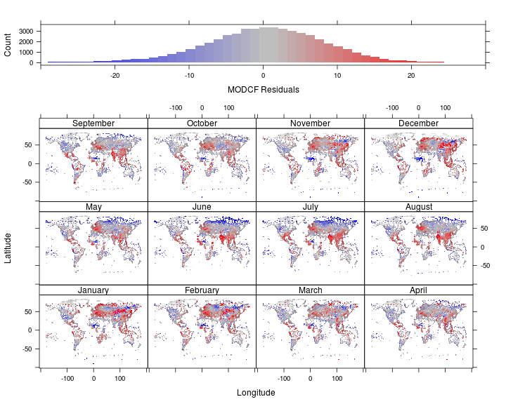
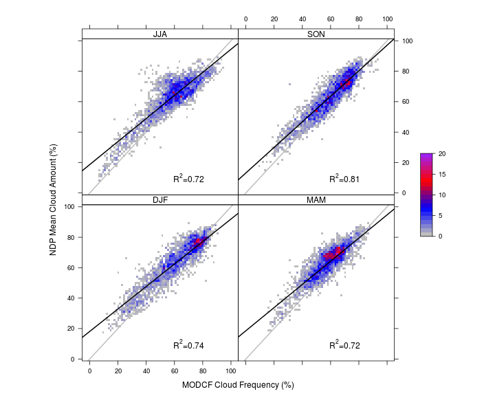
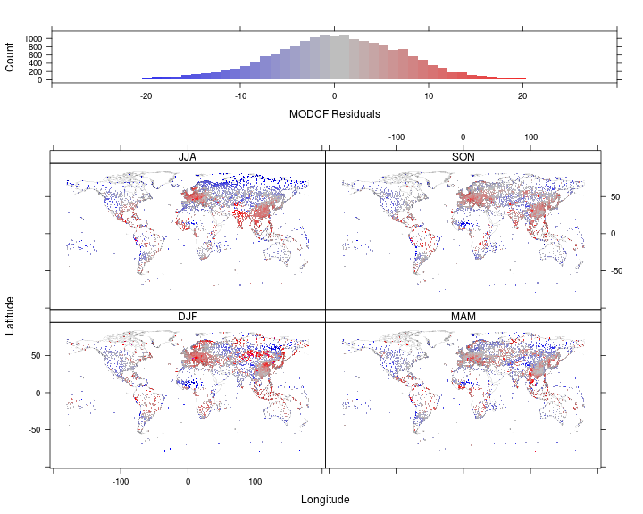
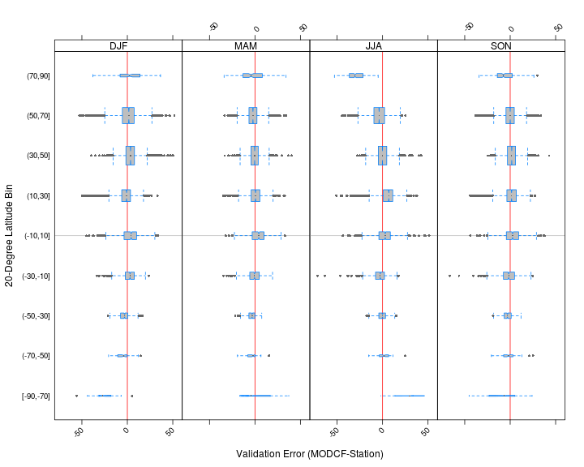
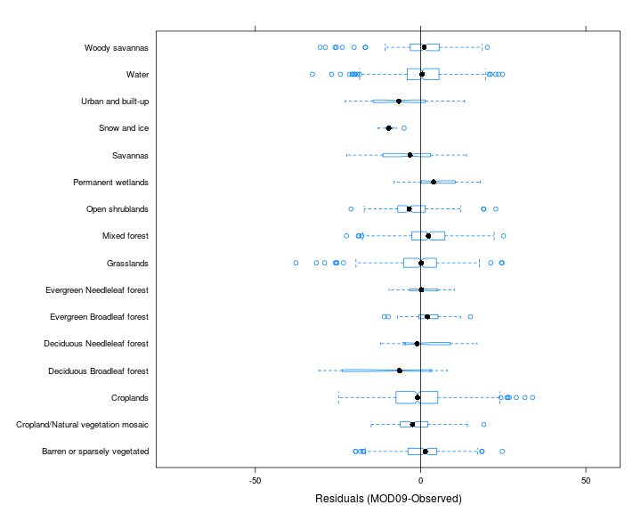
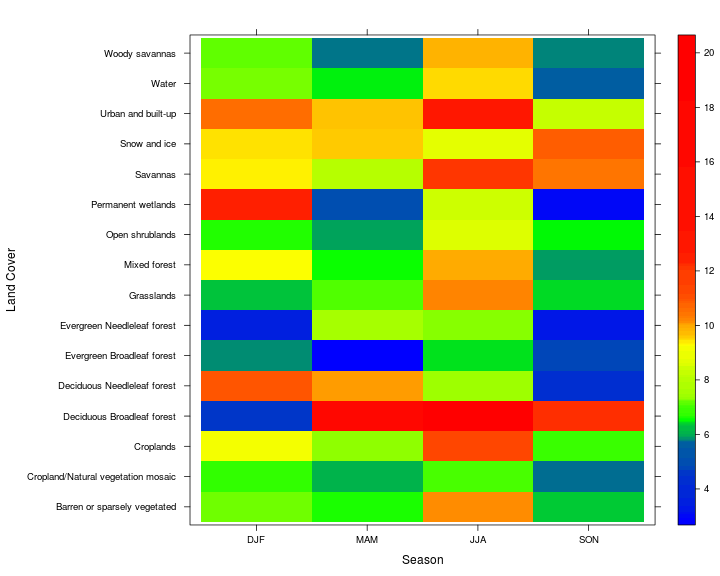

Appendix A: Methods & Validation
=======================

This appendix includes details of the validation procedure.

## Station Observations

The monthly CF were validated using a global observational dataset of synoptic weather reports collected at 5388 stations over 1971-2009 (Eastman and Warren 2012).  We extracted the mean “total cloud” amount for each month, which represents the mean proportion of the sky that was covered by all types of cloud during the observations in that month.  Comparison of these observations to satellite data must take into account that the sampling radius of these observations (the visible sky) depends on cloud height, cloud thickness, the curvature of the earth, and other factors, but is typically much larger than a single 1km MODIS pixel.  We followed Dybbroe, Karlsson, and Thoss (2005) and took the mean monthly MODCF for a circle with 16km radius around each station location.  Additionally, this converts the temporal MODCF to mean cloud amount within the sample radius to make it comparable to the station observations.

The monthly MODCF (including data from 2000-2013) were compared to station observations using linear models over the full station record (1970-2009) and the MODIS era (2000-2009) to assess accuracy and relevance of the 14-year satellite-derived data for estimating long-term monthly climatologies.  For the full record comparison, the station dataset was filtered to include only stations with at least 20 observations per month for at least 20 years, which retained 4679 stations.  Several countries (notably the USA, Canada, and New Zealand) converted from human cloud observations to automated laser ceilometers over the past decade leading to a decline in the number of observations over 1997-2009 (Eastman and Warren 2012). For the MODIS era comparison, we included only stations with at least 20 observations per month for the full 10-year period (2000-2009), so the number of stations available was reduced to 1558. 

### Monthly Comparison
 
Mean monthly cloud amount over 1970-2009 from 5388 global stations versus mean 2000-2009 MOD09 cloud frequency by month.  Coefficient of determination is shown in each panel.  Colors represent the number of monthly station observations within each grid cell of the scatterplot.

#### Spatial Distribution 
 

Histogram and spatial distribution of residuals from linear model between station and satellite cloud amount at station locations.  Negative (positive) values indicate locations where MODCF was less than (greater than) expected given the global relationship between MODCF and station observations.  

### Seasonal Validation
In addition to monthly validation we also performed the same validation on the seasonal (DFJ,MAM,JJA,SON) mean values.
 

 

___________________________
## Temporal Stability

To assess the accuracy of the MODCF product in estimating multi-decadal cloud frequencies, we used linear models between the 2000-2014 satellite climatologies and station observations divided into two periods including the full station record (1970-2009) and the MODIS-era subset (2000-2009).     

<table cellspacing="0" align="center" style="border: none;">
  <caption align="bottom" style="margin-top:0.3em;">Comparison of MODCF accuracy over two time periods, the full station record (1970-2009) and the 'MODIS-era' (2000-2014).</caption>
  <tr>
    <th style="text-align: left; border-top: 2px solid black; border-bottom: 1px solid black; padding-right: 12px;"></th>
    <th style="text-align: left; border-top: 2px solid black; border-bottom: 1px solid black; padding-right: 12px;"><b>1970-2009</b></th>
    <th style="text-align: left; border-top: 2px solid black; border-bottom: 1px solid black; padding-right: 12px;"><b>2000-2009</b></th>
  </tr>
  <tr>
    <td style="padding-right: 12px; border: none;">Intercept</td>
    <td style="padding-right: 12px; border: none;">14.61 (0.18)***</td>
    <td style="padding-right: 12px; border: none;">13.41 (0.19)***</td>
  </tr>
  <tr>
    <td style="padding-right: 12px; border: none;">MODCF</td>
    <td style="padding-right: 12px; border: none;">0.79 (0.00)***</td>
    <td style="padding-right: 12px; border: none;">0.80 (0.00)***</td>
  </tr>
  <tr>
    <td style="border-top: 1px solid black;">R-Squared</td>
    <td style="border-top: 1px solid black;">0.81</td>
    <td style="border-top: 1px solid black;">0.78</td>
  </tr>
  <tr>
    <td style="padding-right: 12px; border: none;">RMSE</td>
    <td style="padding-right: 12px; border: none;">7.37</td>
    <td style="padding-right: 12px; border: none;">7.98</td>
  </tr>
  <tr>
    <td style="border-bottom: 2px solid black;">n</td>
    <td style="border-bottom: 2px solid black;">17013.00</td>
    <td style="border-bottom: 2px solid black;">17021.00</td>
  </tr>
  <tr>
    <td style="padding-right: 12px; border: none;" colspan="3">***p &lt; 0.001, **p &lt; 0.01, *p &lt; 0.05</td>
  </tr>
</table>

____________________________
## Latitudinal Bias in MODCF

 

The MODCF tends to overestimate CF at higher latitudes in winter months, and underestimate it in summer months.  

<!-- html table generated in R 3.1.0 by xtable 1.7-3 package -->
<!-- Fri Apr 25 17:35:42 2014 -->
<TABLE border=1>
<TR> <TH>  </TH> <TH> seas </TH> <TH> [-90,-70] </TH> <TH> (-70,-50] </TH> <TH> (-50,-30] </TH> <TH> (-30,-10] </TH> <TH> (-10,10] </TH> <TH> (10,30] </TH> <TH> (30,50] </TH> <TH> (50,70] </TH> <TH> (70,90] </TH>  </TR>
  <TR> <TD align="right"> 1 </TD> <TD> DJF </TD> <TD> 28.6 (20) </TD> <TD> 8.8 (62) </TD> <TD> 6.8 (440) </TD> <TD> 8.4 (776) </TD> <TD> 11.6 (865) </TD> <TD> 9.9 (2044) </TD> <TD> 8.7 (5088) </TD> <TD> 11 (3753) </TD> <TD> 14.8 (116) </TD> </TR>
  <TR> <TD align="right"> 2 </TD> <TD> MAM </TD> <TD> 16.3 (10) </TD> <TD> 8.2 (44) </TD> <TD> 6.3 (301) </TD> <TD> 8.6 (518) </TD> <TD> 10.5 (580) </TD> <TD> 8.8 (1363) </TD> <TD> 6.7 (3469) </TD> <TD> 7.8 (2555) </TD> <TD> 14.7 (154) </TD> </TR>
  <TR> <TD align="right"> 3 </TD> <TD> JJA </TD> <TD> 26.1 (3) </TD> <TD> 7.3 (69) </TD> <TD> 5.5 (601) </TD> <TD> 9.1 (1050) </TD> <TD> 10.5 (1176) </TD> <TD> 10.7 (2725) </TD> <TD> 7.4 (6864) </TD> <TD> 10.3 (5116) </TD> <TD> 31 (336) </TD> </TR>
  <TR> <TD align="right"> 4 </TD> <TD> SON </TD> <TD> 21.2 (17) </TD> <TD> 8.5 (64) </TD> <TD> 6.5 (443) </TD> <TD> 10.3 (787) </TD> <TD> 10.7 (881) </TD> <TD> 9.5 (2050) </TD> <TD> 6.8 (5201) </TD> <TD> 7.1 (3898) </TD> <TD> 13.3 (239) </TD> </TR>
   </TABLE>

____________________________
## Assess Land-Use Land-Cover bias
 

Boxplot showing residuals (MOD09-Station) by land cover type.  

<!-- html table generated in R 3.1.0 by xtable 1.7-3 package -->
<!-- Fri Apr 25 17:35:43 2014 -->
<TABLE border=1>
<CAPTION ALIGN="bottom"> Table of RMSE's (count) by season (column) and Land Cover (row) </CAPTION>
<TR> <TH> lulcc </TH> <TH> DJF </TH> <TH> MAM </TH> <TH> JJA </TH> <TH> SON </TH>  </TR>
  <TR> <TD> Barren or sparsely vegetated  </TD> <TD> 7.2 (51) </TD> <TD> 6.6 (36) </TD> <TD> 10.1 (72) </TD> <TD> 6.4 (54) </TD> </TR>
  <TR> <TD> Cropland/Natural vegetation mosaic  </TD> <TD> 6.7 (38) </TD> <TD> 6.1 (27) </TD> <TD> 7.1 (56) </TD> <TD> 5.8 (41) </TD> </TR>
  <TR> <TD> Croplands  </TD> <TD> 9.2 (174) </TD> <TD> 7.3 (127) </TD> <TD> 11.2 (253) </TD> <TD> 6.9 (188) </TD> </TR>
  <TR> <TD> Deciduous Broadleaf forest  </TD> <TD> 4.7 (2) </TD> <TD> 16.8 (3) </TD> <TD> 20.7 (8) </TD> <TD> 12.3 (5) </TD> </TR>
  <TR> <TD> Deciduous Needleleaf forest  </TD> <TD> 11 (6) </TD> <TD> 10.1 (4) </TD> <TD> 7.4 (8) </TD> <TD> 4.3 (6) </TD> </TR>
  <TR> <TD> Evergreen Broadleaf forest  </TD> <TD> 5.8 (21) </TD> <TD> 2.7 (14) </TD> <TD> 6.5 (28) </TD> <TD> 4.7 (21) </TD> </TR>
  <TR> <TD> Evergreen Needleleaf forest  </TD> <TD> 3.5 (4) </TD> <TD> 7.7 (3) </TD> <TD> 7.3 (8) </TD> <TD> 3.2 (6) </TD> </TR>
  <TR> <TD> Grasslands  </TD> <TD> 6.3 (102) </TD> <TD> 7.1 (70) </TD> <TD> 10.2 (148) </TD> <TD> 6.4 (112) </TD> </TR>
  <TR> <TD> Mixed forest  </TD> <TD> 9.3 (92) </TD> <TD> 6.6 (65) </TD> <TD> 10 (132) </TD> <TD> 5.9 (97) </TD> </TR>
  <TR> <TD> Open shrublands  </TD> <TD> 6.7 (52) </TD> <TD> 5.9 (38) </TD> <TD> 8.5 (76) </TD> <TD> 6.5 (57) </TD> </TR>
  <TR> <TD> Permanent wetlands  </TD> <TD> 12.3 (9) </TD> <TD> 5.1 (6) </TD> <TD> 8.5 (12) </TD> <TD> 3.1 (9) </TD> </TR>
  <TR> <TD> Savannas  </TD> <TD> 9.3 (15) </TD> <TD> 8.1 (10) </TD> <TD> 12.1 (20) </TD> <TD> 10.4 (15) </TD> </TR>
  <TR> <TD> Snow and ice  </TD> <TD> 9.5 (3) </TD> <TD> 9.6 (2) </TD> <TD> 8.7 (4) </TD> <TD> 10.9 (3) </TD> </TR>
  <TR> <TD> Urban and built-up  </TD> <TD> 10.6 (9) </TD> <TD> 9.6 (6) </TD> <TD> 13.1 (12) </TD> <TD> 8.2 (9) </TD> </TR>
  <TR> <TD> Water  </TD> <TD> 7.3 (164) </TD> <TD> 6.5 (112) </TD> <TD> 9.5 (226) </TD> <TD> 5.7 (171) </TD> </TR>
  <TR> <TD> Woody savannas  </TD> <TD> 7.2 (58) </TD> <TD> 5.8 (41) </TD> <TD> 9.8 (81) </TD> <TD> 5.8 (60) </TD> </TR>
  <TR> <TD>  </TD> <TD> 10 (12364) </TD> <TD> 8 (8430) </TD> <TD> 10 (16796) </TD> <TD> 8.1 (12726) </TD> </TR>
   </TABLE>

 

